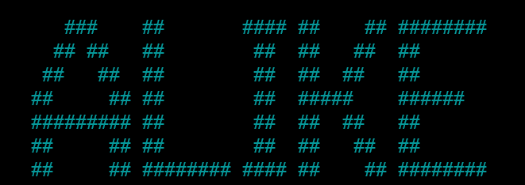
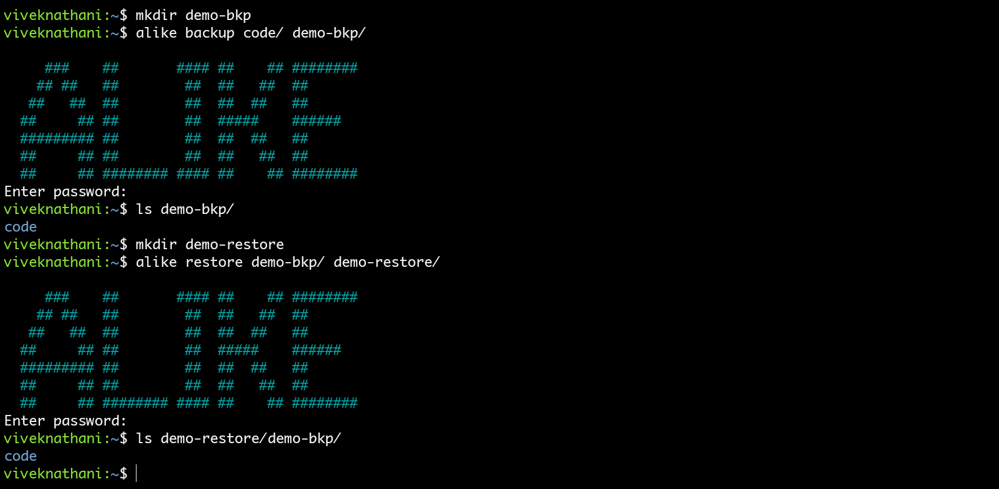

# alike

<p align="center">
    
  <p align="center">
    <a href="https://github.com/rwxLife/alike/releases"></a>
    <a href="https://goreportcard.com/report/github.com/rwxLife/alike"></a>
    <a href="https://codeclimate.com/github/rwxLife/alike/maintainability"></a>
  </p>
</p>

## Contents

- [What?](#what)
- [Why?](#why)
- [Usage](#usage)
- [Caveats](#caveats)
- [Building from source](#building-from-source)
- [Contributing](#contributing)
- [LICENSE](#license)


## What?

`alike` is a program that lets you take **incremental and encrypted** backups of anything. When I say that it is incremental, I mean that `alike` remembers the state of the files. Let's say you had taken a backup of a directory once, and you updated some files into that directory. And now you want to back up the latest version of your directory. A traditional backup program would delete the whole backed-up directory and re-run the whole sequence. alike does not do that. In subsequent attempts to run `alike` over a directory, it runs only for the files that have changed. The encryption used in this program is state-of-the-art ([AES-256](https://en.wikipedia.org/wiki/Advanced_Encryption_Standard) in [CTR mode](https://en.wikipedia.org/wiki/Block_cipher_mode_of_operation#Counter_(CTR))). Backups can be restored whenever needed.

## Why?

It is a part of the project `rwxLife` which intends to provide software for the fundamental aspects of your digital life. People use online storage services and/or external hard drives to backup their data. Online accounts could get compromised and hard drives could get stolen. Many encryption programs exist out there (some of which I have been a part of in the past - [secur3dit](https://github.com/secur3dit/app) and [unseen](https://github.com/viveknathani/unseen)). But providing the ability to run over a directory on its own and also keeping it incremental is not widely seen. 

## Usage

You can get the latest binary/executable release from [here](https://github.com/rwxLife/alike/releases). Once downloaded and extracted, the release is ready to be run just like that. However, it would be more comfortable for you if you place the binary in a place where you normally would place your other executables and have your operating system identify the `PATH` to that location. 

If you have the `PATH` set, you could open up a terminal and just type `alike`.

There are two operations that this program can do: `backup` and `restore`. Below is a demonstration for both.



## Caveats

1. `alike` can often get resource-intensive when backing up large media files. It is better to not run other services when backups are taking place. 

2. Although AES-256 is used under the hood which is the most secure algorithm, the first entry point of the program requires a user-provided password. It is advised to use a strong password. This will get easier in the future as we have plans to release a password manager under the `rwxLife` project. 

3. While restoring, the same password should be used which was used for backing-up. Using a different password could lead to corruption of the backup data. 

4. Each directory inside the the backed-up data contains a `.meta` file. This should not be tampered with. While tampering would not cause issues in the restoration of data, it could cause issues while taking subsequent/incremental backups. 

## Building from source

You might be interested in tinkering with the source code and/or just building the program from source. Here's how you can do it. 

This program is created using `Go v1.16`. Make sure you have it installed along with the tools associated with `Go` for building, testing, and formatting source code. A `Makefile` is used for getting things done at this so you need to have `make` installed in your system (get it from here). On UNIX systems, make sure that you have a directory called `bin` under `~` or `/home/$USER`. 

1. Clone this repository (by downloading or running `git clone`).
2. ```bash
    cd alike
   ```
3. ```bash
    make build # or on Windows: go build
   ```
4. If you are on Windows, you can find your binary in `.\`. Else, you can find a binary in `~/bin` and `./bin/`. Make sure you have your `PATH` configured in both cases.
5. If running `alike` displays the logo, you have built and installed this program successfully!

## Contributing

All kinds of contributions to this repository will be appreciated. You can contribute by making this documentation better, by talking about bugs in the issues section, by fixing bugs, by requesting new features, or by adding new features. If you submit a pull request that contains code, make sure that the code is formatted using `gofmt` and if it requires tests, it is well tested using `make test`. It is ideal to links PRs with issues. Read more about the guidelines over [here](./CONTRIBUTING.md).

## License

[MIT](./LICENSE)
